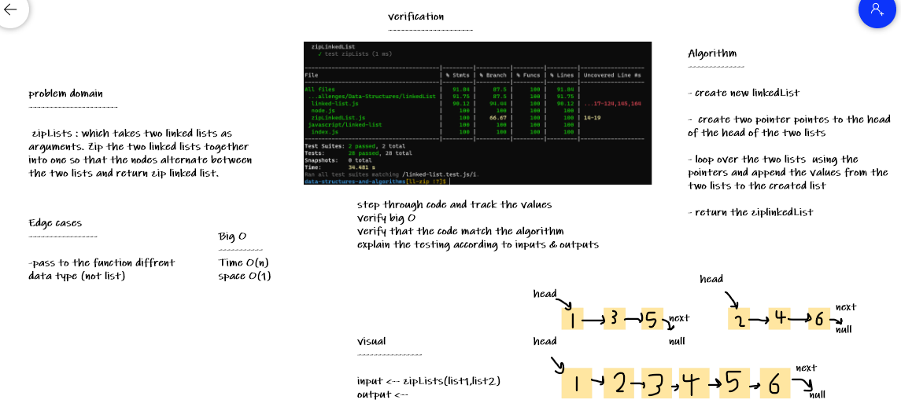

# Singly Linked List

A Linked List is a sequence of Nodes that are linked to each other.
The most defining feature of a Linked List is that each Node references the next Node in the linkedList.

## Challenges :

### code challenge 5

functions for the linked list 
1. insert : add nodes to the head of the linked list 
2. includes : check if the value exists in the linked list 
3. toString : return string representing the value of all nodes in the linked list 

## Approach & Efficiency

* create node class has two properties 
    1. value 
    2. next pointer to point to the next node (by default it's null).

* create linkedList class has property --> head and these methods : 
    * insert method that insert node to the beginning of linkedList(to the head).
        Space: O(1) Time:O(1)
    * include method that search for value if it's exist in linkedList.
       Space: O(1) Time:O(n)
    * toString return the value of each node formatted like : {a}->{b}->NULL.
       Space: O(n) Time:O(n)

## API

### code challenge 6

functions for the linked list 

1. append : add nodes at the end of the linked list 
2. insertBefore : add node before specific value in the linkedList
3. insertAfter : add node after specific value in the linkedList

## Approach & Efficiency

* new methods to the LinkedList class : 

    1.  append(value) which adds a new node with the given value to the end of the list
        Space : O(1)  Time: O(n)

    2.  insertBefore(value, newVal) which add a new node with the given newValue immediately before the first value node
        Space: O(1)  Time: O(n)

    3. insertAfter(value, newVal) which add a new node with the given newValue immediately after the first value node
        Space: O(1)  Time:O(n)
   

## API

[code](./linked-list.js)

### code challenge 7

functions for the linked list 

* kthFromEnd : takes a number, k, as a parameter. Return the node’s value that is k from the end of the linked list.

## Approach & Efficiency

* new methods to the LinkedList class : 

    1.  kthFromEnd(k) which return the node's value that is k from the end of the linked list.
        Space : O(1)  Time: O(n)
   

## API

[code](./linked-list.js)

## Solution

***to run the test:***

npm test linked-list.test.js

### code challenge 8

function :

* zipLists : which takes two linked lists as arguments. Zip the two linked lists together into one so that the nodes alternate between the two lists and return zip linked list.

## Approach & Efficiency

* function : 

    1.  zipLists : which takes two linked lists as arguments. Zip the two linked lists together into one so that the nodes alternate between the two lists and return zip linked list.
    Space : O(1)  Time: O(n)
   

## API

[code](./zipLinkedList.js)

## Solution

***to run the test:***

npm test linked-list.test.js
