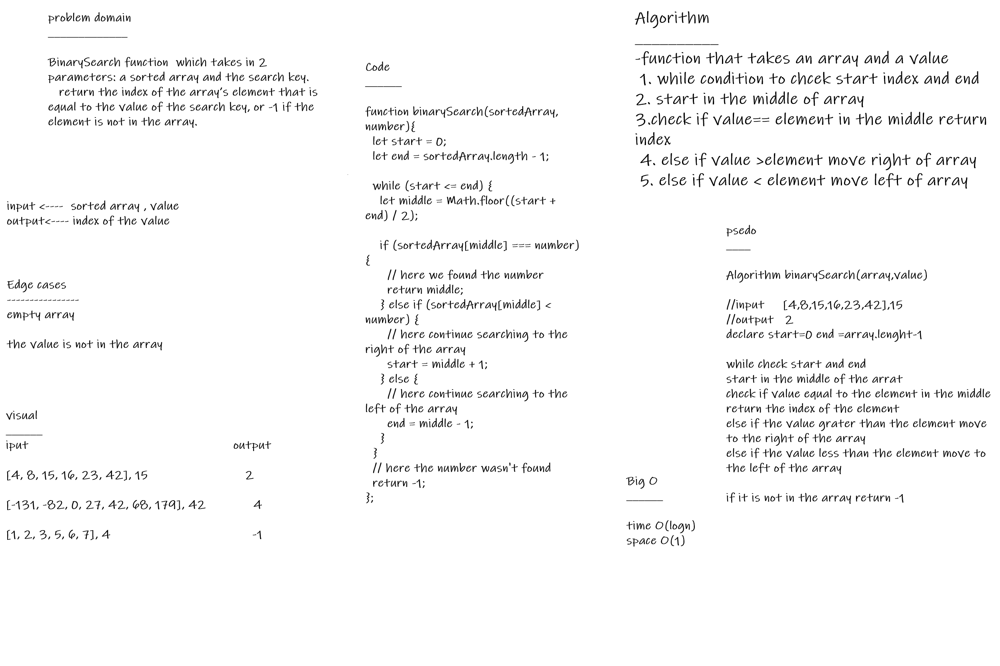

# Binary search 

  BinarySearch function  which takes in 2 parameters: a sorted array and the search key.
   return the index of the array’s element that is equal to the value of the search key, or -1 if the element is not in the array.

## Whiteboard Process

## Approach & Efficiency

* Algorithm binarySearch(array,value)

//input     [4,8,15,16,23,42],15
//output   2
declare start=0 end =array.lenght-1

while check start and end 
start in the middle of the arrat 
check if value equal to the element in the middle return the index of the element 
else if the value grater than the element move to the right of the array
else if the value less than the element move to the left of the array 

if it is not in the array return -1

 * Big O
 1. space O(log n)
 2. time O(1)