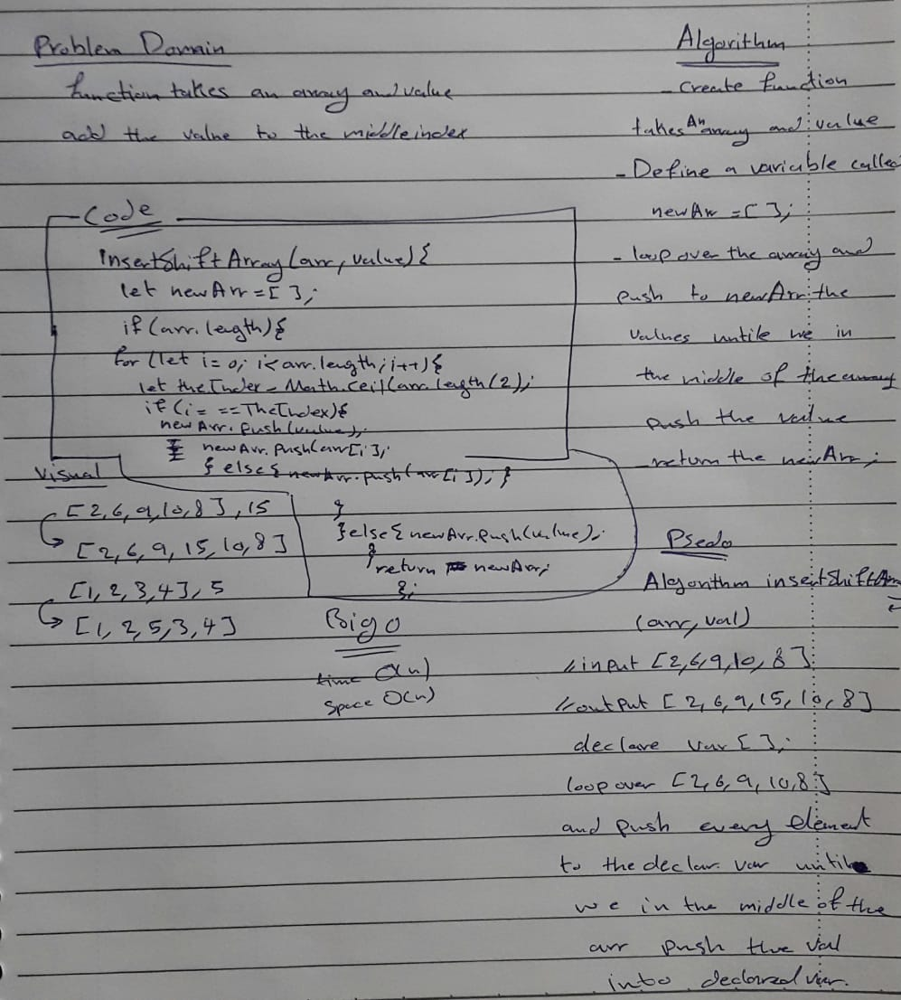

# Insert to Middle of an Array
insertShiftArray function which takes in an array and a value to be added.
 return an array with the new value added at the middle index.

## Whiteboard Process

## Approach & Efficiency

* algorithm insertShiftArray(arr,val)
// input  [2,6,9,10,8],15
// output [2,6,9,15,10,8]
 declare var[]
 loop over [2,6,9,10,8]
 and push every element to the declared var until we in the middle of the arr push the val into the declared var..

 * Big O
 1. space O(n)
 2. time O(n)