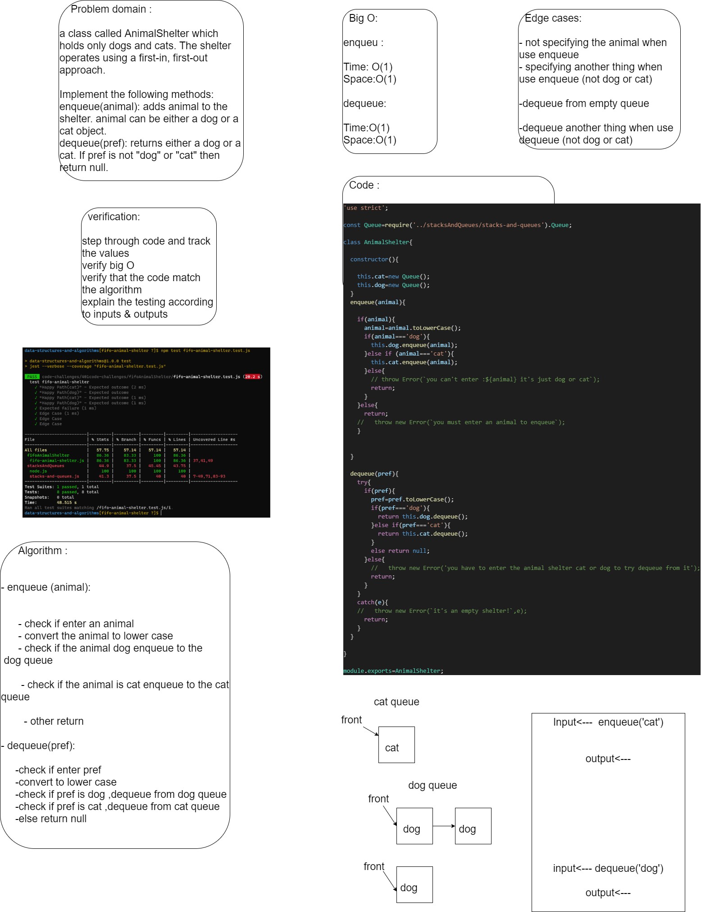
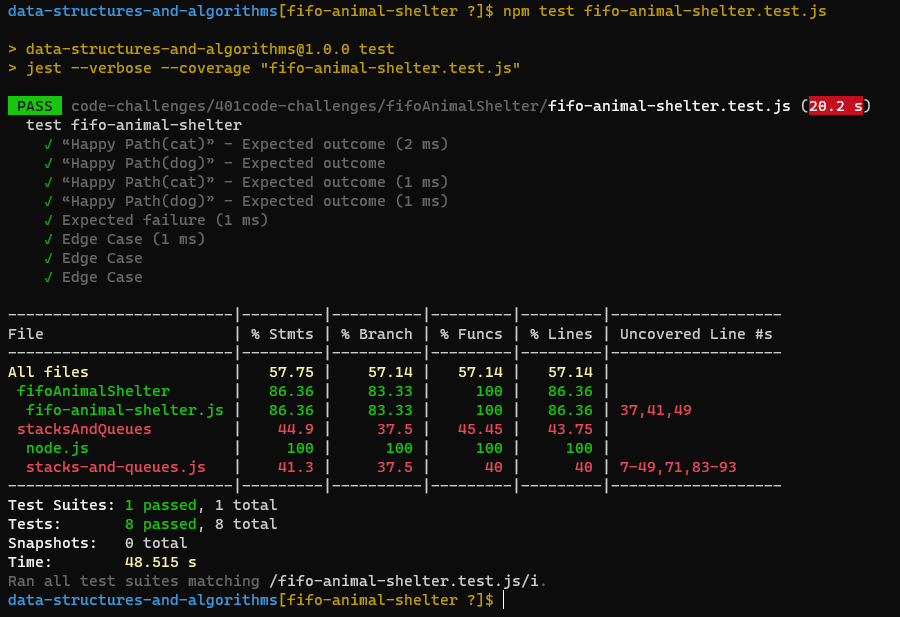

# Challenge Summary
 class called AnimalShelter which holds only dogs and cats. The shelter operates using a first-in, first-out approach.

Implement the following methods:
enqueue(animal): adds animal to the shelter. animal can be either a dog or a cat object.
dequeue(pref): returns either a dog or a cat. If pref is not "dog" or "cat" then return null.

## Whiteboard Process

## Approach & Efficiency

enqueue(animal):
Time: O(1)
Space: O(1)

dequeue(animal):
Time: O(1)
Space: O(1)

## Solution

run the test 🖥️✈️

`npm test fifo-animal-shelter.test.js` 

