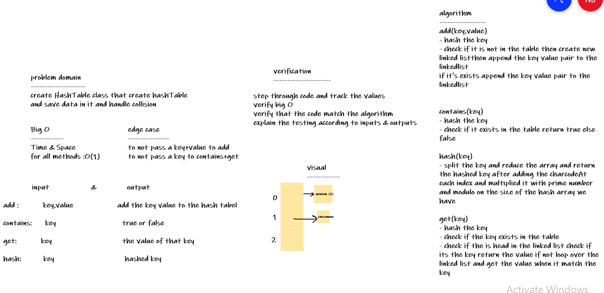

# HashTables

HashTables are a data structure that utilize key value pairs. This means every Node or Bucket has both a key, and a value.

The basic idea of a hashTable is the ability to store the key into this data structure, and quickly retrieve the value. This is done through what we call a hash

## Challenge
HashTable Class with these methods:
- add: takes in both the key and value. This method should hash the key, and add the key and value pair to the table, handling collisions as needed.

- get: takes in the key and returns the value from the table.

- contains: takes in the key and returns a boolean, indicating if the key exists in the table already.

- hash: takes in an arbitrary key and returns an index in the collection.

## Approach & Efficiency
Time and Space complexity for all these methods(add,contains,hash,get): is O(1) 

## API

[code](hashTable.js)