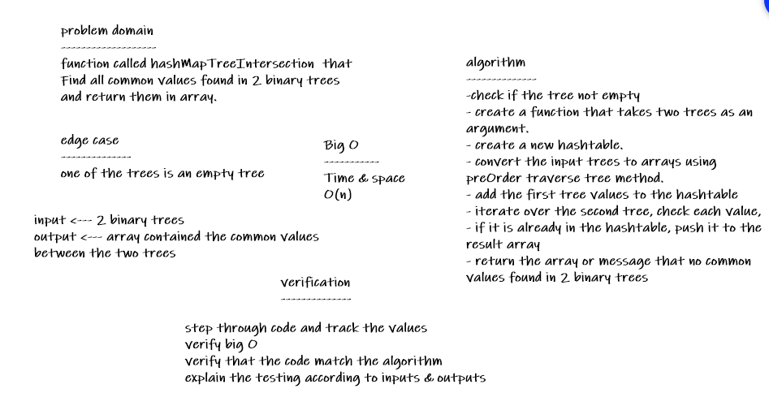
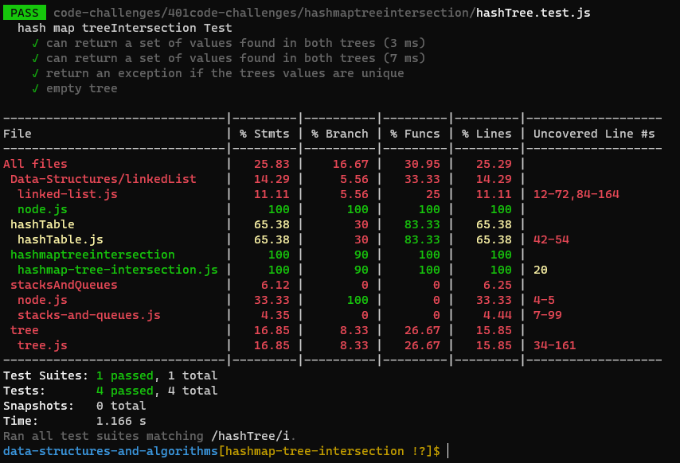

# Challenge Summary
function called hashMapTreeIntersection  that Find all common values found in 2 binary trees and return them in array.

## Whiteboard Process

## Approach & Efficiency
***Big O()***

Time:O(n) 

Space:O(n)  

## Solution
npm test hashTree 

[code](./hashmap-tree-intersection.js)