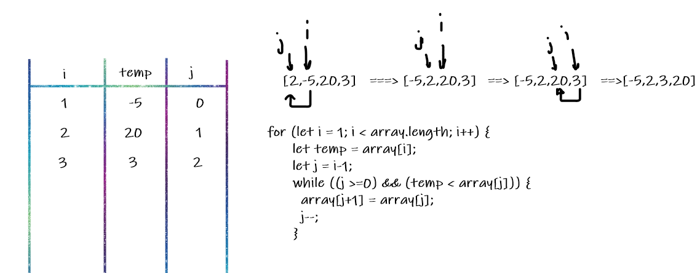

# Insertion Sort
insertion Sort is a sorting algorithm that it's comparing an array value to the one before it. Insertion sort takes in an array of integers and sorts them into ascending order.

## Pseudocode

```
  InsertionSort(int[] arr)
  
    FOR i = 1 to arr.length
    
      int j <-- i - 1
      int temp <-- arr[i]
      
      WHILE j >= 0 AND temp < arr[j]
        arr[j + 1] <-- arr[j]
        j <-- j - 1
        
      arr[j + 1] <-- temp
```
## Trace

Sample Array: [2,-5,20,3]



Pass 1:In the first pass through of the insertion sort,

- i=1
- temp = arr[i] =-5
- and j=i-1 =0

check if the value of j>=0 and temp< arr[j] 

- if its true which it is true now so:

arr[j+1]=arr[j] --> (arr[1]=2)

j=j-1 -->( j=-1 )

pass2 : 
- i=2
- temp =arr[i]=20
- j=1

check :temp< arr[1] false

pass3:
- i=3
- temp=arr[i]=3
- j=2
- check temp < arr[2] --> true so:

arr[3]=3


## Efficiency
* Time:O(n^2)
* Space:O(1)