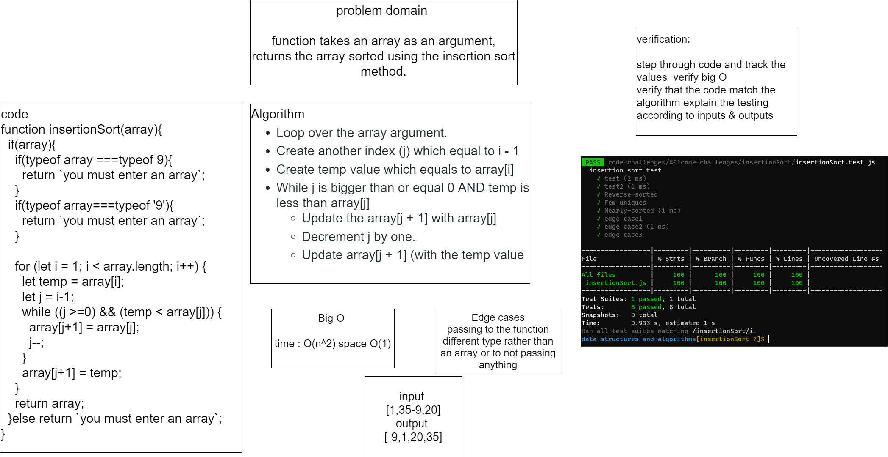
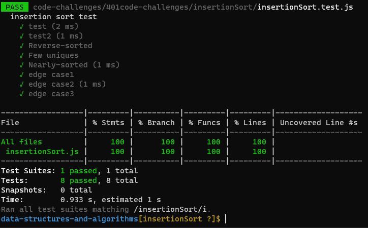

# Challenge Summary

function takes an array as an argument , return the array sorted using insertion sort method .

## Whiteboard Process

## Approach & Efficiency
Time: O(n^2)
Space: O(1)
## Solution
npm test insertionSort

[code](./insertionSort.js)