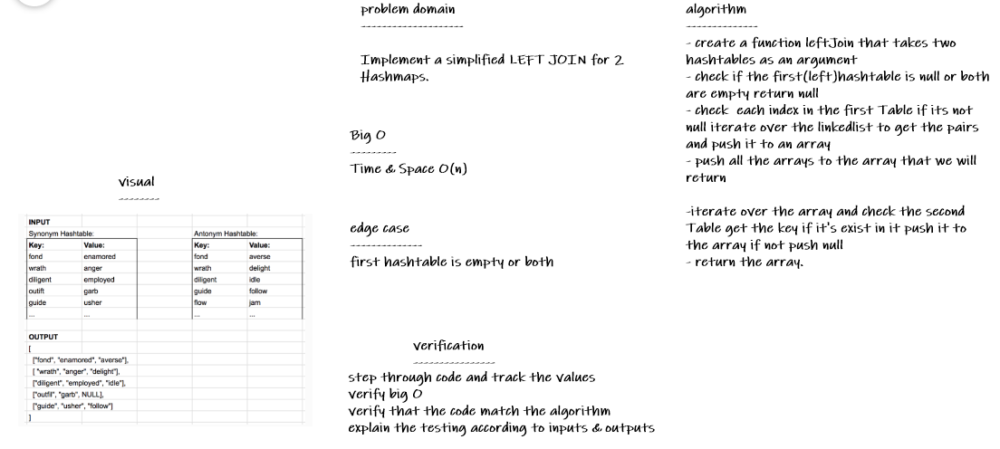
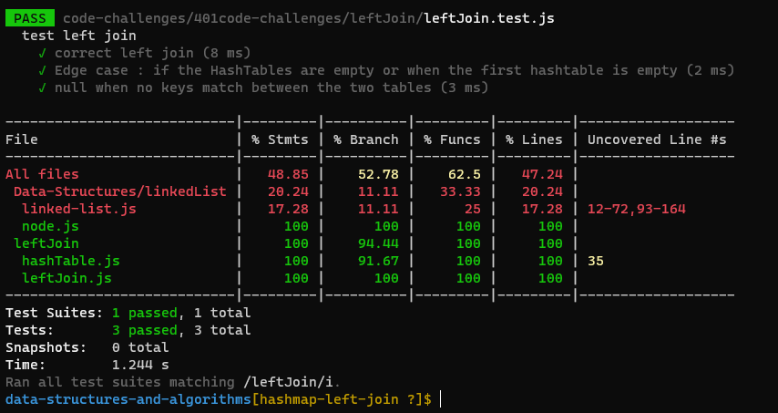

# Hashmap LEFT JOIN
HashTables are a data structure that utilize key value pairs. This means every Node or Bucket has both a key, and a value.

The basic idea of a hashTable is the ability to store the key into this data structure, and quickly retrieve the value. This is done through what we call a hash

## Challenge
Implement a simplified LEFT JOIN for 2 Hashmaps.

## Approach & Efficiency
***Big O:*** 
Time & space O(n)

## Solution

- `npm test leftJoin`

***
[code](./leftJoin.js)