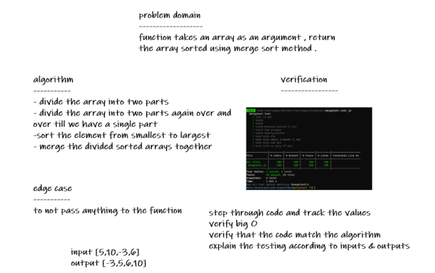
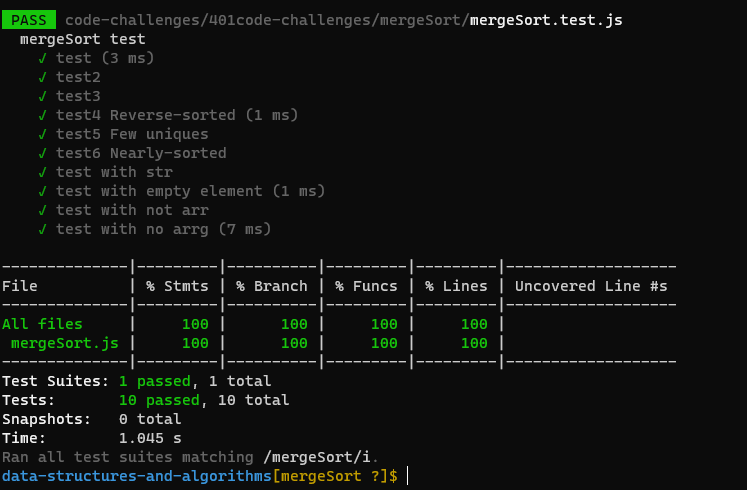

# Challenge Summary

function takes an array as an argument , return the array sorted using merge sort method .

## Whiteboard Process

## Approach & Efficiency
Time: O(nlogn)
Space: O(n)
## Solution
npm test insertionSort

[code](./mergeSort.js)