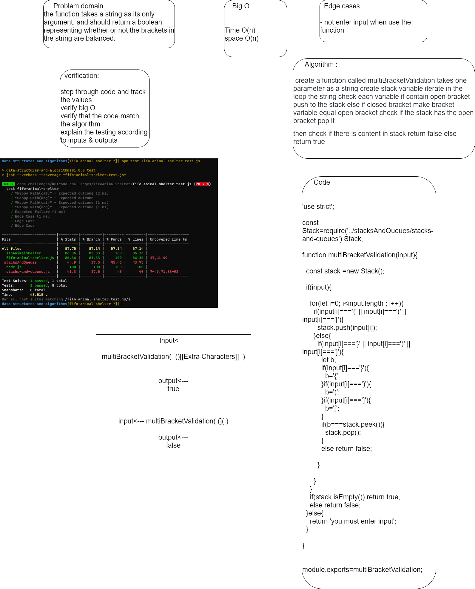
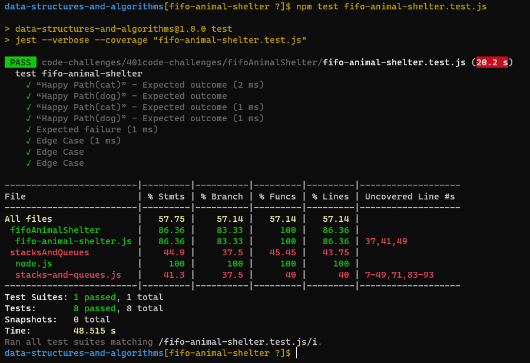

# Challenge Summary

the function takes a string as its only argument, and should return a boolean representing whether or not the brackets in the string are balanced.

## Whiteboard Process

## Approach & Efficiency

Time: O(n)
Space: O(n)

## Solution

run the test 🖥️✈️

`npm test multi-bracket.test.js` 

## 
[code](./multi-bracket-validation.js)