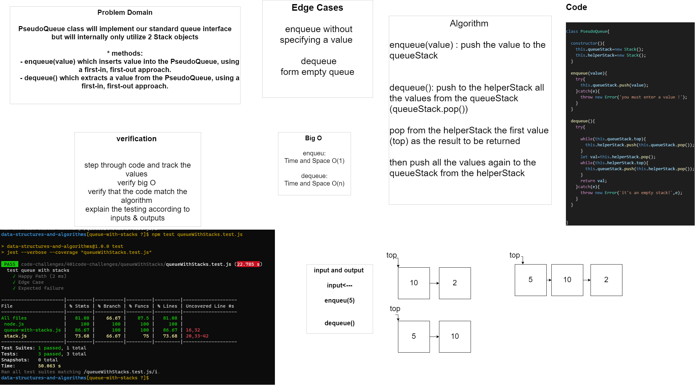

# Challenge Summary
PseudoQueue class will implement our standard queue interface 
but will internally only utilize 2 Stack objects 

* methods:
    - enqueue(value) which inserts value into the PseudoQueue, using a first-in, first-out approach.
    - dequeue() which extracts a value from the PseudoQueue, using a first-in, first-out approach.

## Whiteboard Process

## Approach & Efficiency

Big O : 
* enqueue:
    - Time: O(1)
    - Space:O(1)

* dequeue: 
    - Time: O(n)
    - Space:O(n)

## Solution
To run the test 🖥️ ✈️ -----> 

 `npm test queueWithStacks.test.js`

### ***[code](queue-with-stacks.js)*** 🖥️