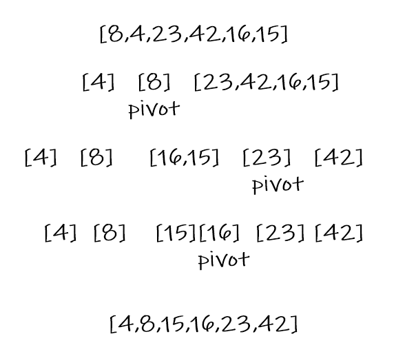

# Quick Sort
Quicksort is a divide-and-conquer algorithm. It works by selecting a 'pivot' element from the array and partitioning the other elements into two sub-arrays, according to whether they are less than or greater than the pivot.

## Pseudocode

```
 ALGORITHM QuickSort(arr, left, right)
    if left < right
        // Partition the array by setting the position of the pivot value 
        DEFINE position <-- Partition(arr, left, right)
        // Sort the left
        QuickSort(arr, left, position - 1)
        // Sort the right
        QuickSort(arr, position + 1, right)

ALGORITHM Partition(arr, left, right)
    // set a pivot value as a point of reference
    DEFINE pivot <-- arr[right]
    // create a variable to track the largest index of numbers lower than the defined pivot
    DEFINE low <-- left - 1
    for i <- left to right do
        if arr[i] <= pivot
            low++
            Swap(arr, i, low)

     // place the value of the pivot location in the middle.
     // all numbers smaller than the pivot are on the left, larger on the right. 
     Swap(arr, right, low + 1)
    // return the pivot index point
     return low + 1

ALGORITHM Swap(arr, i, low)
    DEFINE temp;
    temp <-- arr[i]
    arr[i] <-- arr[low]
    arr[low] <-- temp
```
## Trace

Sample Array: [8,4,23,42,16,15]



Pass 1:In the first pass through of the quick sort,

- make the first element as pivot
- check array values if it > pivot let it in the right if its less let it in the left


pass2 : 
in the right 
- make the first element as pivot 
- check array values if it > pivot let it in the right if its less let it in the left.

check :temp< arr[1] false

pass3:
in the left 
- make the first element as pivot 
- check the array values if it > pivot let it in the right if its less let it in the left.


## Efficiency
* Time:O(nlogn)
* Space:O(1)