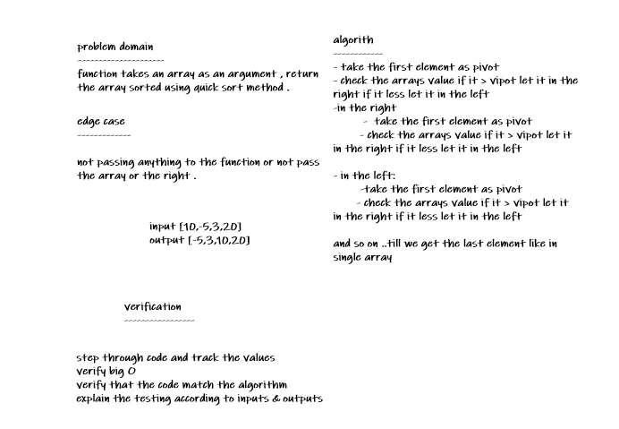
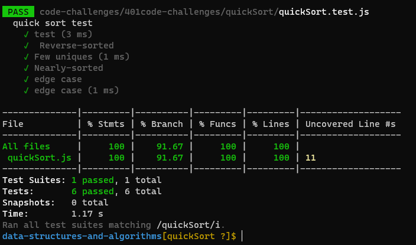

# Challenge Summary

function takes an array as an argument , return the array sorted using quick sort method .

## Whiteboard Process

## Approach & Efficiency
Time: O(nlogn)

Space: O(1)

## Solution
npm test insertionSort

[code](./quickSort.js)