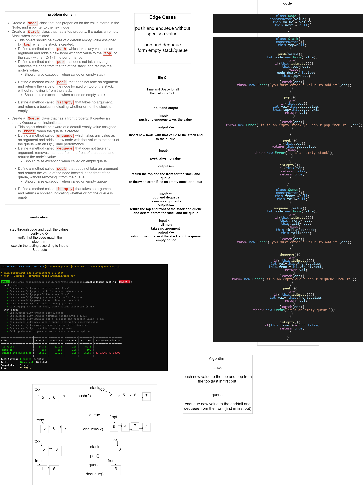

# Stacks and Queues

The stack and the queue are a data structure that consists of Nodes. Each Node references the next Node in the stack/in the queue.

- LIFO: Last In First Out(stack)

- FIFO: First In First Out(queue)

## Challenge

Stack class with these methods: push,pop,peek,isEmpty  

Queue class with these methods: enqueue,dequeue,peek,isEmpty

## Approach & Efficiency

* Stack: 
    - push Time: O(1) Space:O(1)
    - pop Time: O(1) Space:O(1)
    - peek Time: O(1) Space:O(1)
    - isEmpty Time: O(1) Space:O(0)

* queue: 
    - enqueue Time: O(1) Space:O(1)
    - dequeue Time: O(1) Space:O(1)
    - peek Time: O(1) Space:O(1)
    - isEmpty Time: O(1) Space:O(0)

## API
