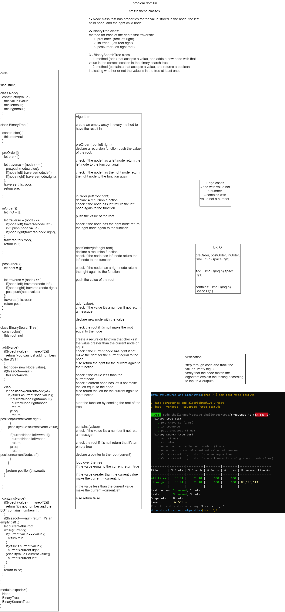
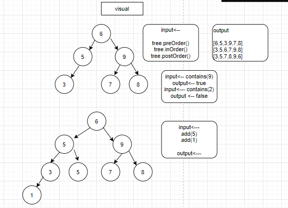

# Trees

- Node class that has properties for the value stored in the node, the left child node, and the right child node.

- BinaryTree class
  methods:
    * preOrder
    * inOrder 
    * postOrder 

- BinarySearchTree class 
  methods:
    * add
    * contains

## Challenge
- BinaryTree class:
method for each of the depth first traversals:
  * preOrder  (root left right)
    * inOrder   (left root right)
    * postOrder (left right root)

- BinarySearchTree class 
    * method (add) that accepts a value, and adds a new node with that value in the correct location in the binary search tree.
    * method (contains) that accepts a value, and returns a boolean indicating whether or not the value is in the tree at least once

## Approach & Efficiency
- preOrder, inOrder and postOrder: Time O(n) space O(h)
- add :Time O(log n) space O(1)
- contains: Time O(log n) Space O(1)

## API

* [code](tree.js)

# Challenge Summary
* code challenge 16 : 

findMaximumValue: function that find the maximum value in the binary tree.

## Whiteboard Process

## Approach & Efficiency

- Time : O(h)
- Space :O(1)

## Solution
npm test tree.test.js

- [code](tree.js)
